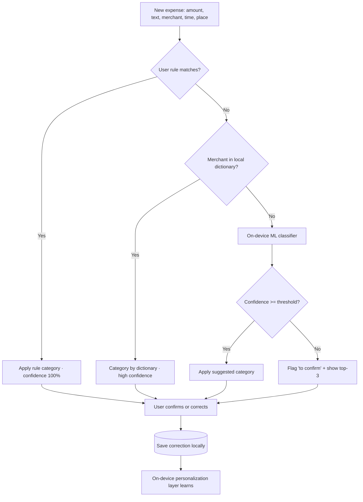

# PRD — “Bolsillo” · Local-first personal finance app with on-device AI expense classification

> **Status:** Draft v1.1 for review · **Platforms:** Android + iOS · **Working name:** *Bolsillo* (provisional)
> **Product thesis:** recording an expense should take under 5 seconds, work without internet, and be categorized automatically by an AI that lives entirely on the phone. Privacy by design, with no mandatory bank connection.
> **v1.1 note:** adds localization (Spanish default, switchable to English) and currency requirements (USD and COP essential, base currency configurable, others addable).

---

## 1. Executive summary

Bolsillo is a money-, expense-, income-, and budget-management app for Android and iOS, designed so that **recording transactions is instant and classification is automatic and accurate without sending data to the cloud**. Unlike most market leaders (Monarch, Rocket Money, Copilot), which rely on bank synchronization via aggregators like Plaid — something limited or expensive outside the U.S. — Bolsillo is **local-first**: all data lives encrypted on the device, works offline, and only syncs if the user explicitly enables it.

The core differentiator is an **expense-classification engine that runs on the phone itself** (Core ML on iOS, LiteRT/ML Kit on Android), which learns from the user's corrections without their financial data ever leaving the device.

The app ships in **Spanish by default, switchable to English**, and with **USD and Colombian peso (COP) as essential currencies**, with the base currency configurable and other currencies addable.

---

## 2. Problem and opportunity

**Real problems validated by 2026 reviews:**

1. **Manual entry is tedious**, which is why people abandon expense apps. The friction of typing each purchase is the #1 cause of churn.
2. **Automatic bank sync is not universal.** It works reasonably in the U.S. (Chase, BofA, etc.) but is fragile, expensive, or nonexistent across much of Latin America and for cash. Cash always requires manual entry.
3. **Privacy:** connecting all your accounts to a third party makes a growing share of users uncomfortable.
4. **Subscriptions are expensive** (YNAB ~US$14.99/mo; Monarch ~US$99.99/yr), which clashes with the goal of saving.
5. **Generic categorization fails** with local merchants or personal ways of classifying (one person tags coffee as “Productivity”, another as “Leisure”).

**Opportunity:** combine the recording speed of minimalist apps (Monefy, Finny), the budgeting robustness of serious apps (YNAB, Monarch), and **on-device AI categorization that learns from you**, all with no mandatory cloud and at a low cost.

---

## 3. Goals and success metrics

| Goal | Metric (KPI) | 6-month post-launch target |
|---|---|---|
| Fast recording | Median time from “open app → expense saved” | ≤ 5 s |
| Minimal friction | Median taps to record a recurring expense | ≤ 3 |
| Accurate classification | % of expenses whose suggested category the user does **not** correct | ≥ 90% after 50 transactions |
| Retention | 30-day active users (D30) | ≥ 35% |
| Habit | % of users recording ≥ 4 days/week | ≥ 40% |
| Trust | % of users who enable encrypted backup | ≥ 50% |
| Performance | Cold start | ≤ 1.5 s |
| Privacy | Financial data leaving the device by default | 0 |

---

## 4. Target users (personas)

- **Ana, “quick control” (core).** Wants to know where her money goes without spending time on it. Uses lots of cash and card. Doesn't want to connect her bank. Needs to record in seconds.
- **Carlos, “disciplined budgeter”.** Likes assigning every peso a job (YNAB-style). Wants per-category budgets and alerts.
- **Sofía, “traveler / freelancer”.** Handles multiple currencies and accounts, irregular income. Needs reliable multi-currency and reports.
- **A couple (Ana + Luis).** Want a shared budget and to see who spent what (the case that drove the mass migration after Mint shut down).

---

## 5. Competitive analysis — who does what best

This grounds the product decisions. Summary of what the 2026 market considers “best in class”:

| App | Main strength | What we take | What we avoid |
|---|---|---|---|
| **Monarch Money** | Best all-in-one and Mint replacement; flexible budgeting (fixed / non-monthly recurring / flexible), net worth, couple collaboration, bulk recategorization | Flex budgeting by buckets, bulk editing, couple mode, tags | Dependence on bank sync; high price |
| **YNAB** | Gold standard of zero-based budgeting (“give every dollar a job”); education and method | Optional zero-based budgeting mode for advanced users | Steep learning curve; no free plan; expensive |
| **Copilot** | Very strong ML categorization; premium experience in the Apple ecosystem | ML categorization quality and careful design | iOS/Apple-only; single user |
| **Rocket Money** | Subscription detection/management and recurring cancellation | Automatic detection of recurring expenses and subscriptions | Single-login sharing; focus on bill negotiation |
| **PocketGuard** | Spending guardrails and the *Pace* feature (warns if you're spending your budget too fast given the days remaining) | The “spending pace” concept and how much you have free | 7-day trial disguised as free |
| **Quicken Simplifi** | Personalized spending plan that adjusts itself and projects cash flow based on upcoming bills | Cash-flow projection and adaptive plan | — |
| **Spendee / Wallet (BudgetBakers)** | Best charts and visual spending clarity | Visual report design, clarity | — |
| **Monefy** | **Ultra-fast** recording and 100% offline | Entry speed and offline operation | Very limited budgeting features |
| **Finny** | AI entry (“tap to record”), offline, multi-currency (unified currency view that preserves the original amount), low price | AI-assisted entry, multi-currency preserving the original amount, cheap model | — |

**How they categorize today (3 approaches, from least to most capable):**

1. **By database / merchant:** “Starbucks → Coffee shop”. Fast but fails with unknown or local merchants.
2. **By user rules:** “everything from Uber → Transport”. Useful but becomes unmanageable at scale.
3. **By ML / NLP:** analyzes merchant name, description, amount, and history. A base model reaches ~70–80% accuracy; after ~50–100 user corrections it rises to ~95%+. Best practice is to show **confidence** and flag low-confidence items for review.

**Positioning decision:** we combine all three approaches (merchant dictionary + rules + ML), but **all on the device**, with personalized learning. We compete in the manual/offline/privacy segment (Monefy, Finny, Bluecoins, Money Manager, Actual Budget), and we differentiate with local AI categorization and natural-language entry.

---

## 6. Product principles

1. **Speed above all in recording.** If it takes more than 5 s, we've failed.
2. **Local-first and private by default.** Nothing leaves the phone without an explicit user action.
3. **AI suggests, the user decides.** Every automatic decision is correctable with one tap, and the system learns from it.
4. **Financial robustness.** Money is never lost or unbalanced: exact, auditable arithmetic.
5. **Always works offline.** Connectivity is optional, never a requirement.
6. **Simple by default, powerful on demand.** Ana sees something simple; Carlos can enable zero-based budgeting.
7. **Localized and multi-currency from day one.** Spanish by default and switchable to English; USD and COP essential with the ability to add other currencies.

---

## 7. Scope

### MVP (v1.0)
- Fast expense/income recording (numeric keypad as the opening screen).
- Accounts (cash, cards, manual bank) with balances.
- Categories and subcategories (predefined + customizable).
- **Local AI categorization** (dictionary + rules + ML classifier) with on-device learning.
- **Natural-language** entry (“coffee 8k”) and **receipt-photo (on-device OCR)** entry.
- Per-category budgets + alerts.
- Recurring expenses / subscriptions.
- Basic reports (by category, by month, trends) with good charts.
- Encrypted backup and export (local file / CSV / app file).
- **Multi-currency** with rate stored per transaction; **USD and COP preloaded as essential**, base currency configurable, others addable.
- **Localization:** Spanish as the default language, **switchable to English** from settings.

### Post-MVP (v1.x – v2)
- “Flex” budgeting by buckets and optional zero-based mode.
- **Couple / shared** mode (optional E2E-encrypted sync).
- Cash-flow projection (Simplifi-style).
- Savings goals.
- Net worth.
- Advanced widgets, Apple Watch / Wear OS.
- Automatic subscription detection from history.
- **On-device LLM** for natural-language summaries (“where did I overspend this month?”).
- *Optional* bank sync by country (where an aggregator exists).
- Additional UI languages beyond Spanish and English.

### Out of scope (for now)
- In-depth investments/brokerage, credit scoring, bill negotiation, regulated financial advice.

---

## 8. Functional requirements

### 8.1 Expense recording (the heart of the product)
- **Opening screen = numeric keypad.** When the app opens, the cursor is on the amount.
- **3-tap flow:** amount → (category and account already pre-suggested by AI) → save.
- **Smart pre-fill:** category, account, and merchant suggested by the AI based on time, location (if permission is granted, on-device), and recent patterns.
- **Natural-language entry:** “lunch with client 45k” → amount 45,000, category Restaurants, note “with client”.
- **Receipt photo:** on-device OCR (Apple Vision / ML Kit Text Recognition) extracts amount, date, and merchant; the AI proposes a category.
- **Favorites / templates / recents:** one tap to repeat frequent expenses (e.g., “daily coffee”).
- **System shortcuts:** home-screen and lock-screen widget, App Shortcuts / Quick Settings, voice dictation, watch.
- **First-class cash entry** (not a second-class citizen as in bank-centric apps).

### 8.2 Accounts and balances
- Types: cash, debit/credit card, bank account (manual), savings, wallet, other.
- Initial balance and real-time computed balance.
- **Transfers between accounts** modeled as a pair of linked transactions (not counted as expense/income).
- Credit card support with statement and payment dates.

### 8.3 Categorization (manual + AI)
- Default category tree (Food, Transport, Housing, Utilities, Health, Leisure, Education, Shopping, etc.) + customizable with icon and color.
- Automatic suggestion with a **confidence indicator**: high → applied automatically; low → flagged “to confirm”.
- **User rules:** “if merchant contains ‘UBER’ → Transport”.
- **Bulk reclassification:** select several and recategorize at once (key in Monarch/PocketGuard).
- Every user correction feeds local learning (see §9).

### 8.4 Budgets
- Per-category budget (monthly/weekly/custom).
- **Spending-pace** indicator (PocketGuard *Pace*-style): how much you have left and whether you're going too fast for the days remaining.
- “Available to spend” after covering fixed costs, debts, and goals.
- Optional **zero-based** mode (YNAB-style) for advanced users.
- Optional **flex** mode by buckets: fixed / non-monthly recurring / flexible (Monarch-style).
- Configurable alerts (80%, 100%, overspend).

### 8.5 Recurring and subscriptions
- Mark a transaction as recurring (frequency, next date, reminder).
- Automatic or semi-automatic generation of the next transaction.
- View of active subscriptions and total monthly/annual cost.
- (Post-MVP) automatic recurrence detection from history.

### 8.6 Reports and insights
- By category, account, period, tag, merchant.
- Month-over-month comparisons and trends.
- Clear charts (donut, bars, lines) focused on legibility (Spendee reference).
- Weekly recap generated on-device.
- Report export (CSV / PDF).

### 8.7 Multi-currency
- Currency per account and per transaction.
- **USD and Colombian peso (COP) preloaded as essential currencies**; the base currency is configurable and additional currencies can be added.
- **Exchange rate stored on each transaction** (the rate at the time), not recomputed later → historical robustness.
- Unified view that converts totals to the base currency **preserving the original amount** (Finny reference).
- Rates updatable manually or via optional download when connected.

### 8.8 Localization (language)
- **Default language: Spanish.** The user can **switch to English** from settings; the change applies app-wide.
- i18n/l10n architecture ready to add more languages later without code changes.
- Number, currency, and date formats follow the selected language/region.

### 8.9 Data, backup, and portability
- **Export / import** CSV and an encrypted proprietary format.
- Encrypted backup to the user's storage (local file, the user's own iCloud/Drive), never to our servers by default.
- Import from bank CSV statements and from other apps (migration).
- No lock-in: the user owns their data.

### 8.10 Search and management
- Search by text, amount, date range, category, tag, account.
- Edit and delete with history/trash (nothing is lost accidentally).
- Free-form tags in addition to categories.

---

## 9. On-device AI classification engine (key differentiator)

### 9.1 Goal
Classify each expense into the correct category **without sending data to the cloud**, improving with each person's usage.

### 9.2 Cascade architecture (fast → smart)

**Layer 1 — User rules** (deterministic, instant, 100% confidence).
**Layer 2 — Local merchant dictionary** (includes popular local/LatAm merchants), updatable as data, not as a model.
**Layer 3 — On-device ML classifier:** a lightweight model that takes features (embedded merchant/note text, normalized amount, day/hour, recurrence) and returns a category + **confidence probability**.

### 9.3 Model and runtime
- **iOS:** Core ML / Core AI; option to use **Apple Foundation Models** (system on-device LLM, ~3B, no API or network cost) for natural-language parsing and summaries.
- **Android:** **LiteRT** (formerly TensorFlow Lite) and **ML Kit GenAI / Gemini Nano** via AI Core; open models like **Gemma 3n** for generative cases.
- **Cross-platform:** a classifier exported to **ONNX** run with ONNX Runtime Mobile, or twin per-platform models. The **category classifier** can be small (text embeddings + classification head, or logistic regression / kNN over embeddings) → fast and light on memory.
- **Receipt OCR:** Apple Vision (iOS) / ML Kit Text Recognition (Android), on-device.

### 9.4 Cold start and personalization
- A **pre-trained base model** ships with a generic corpus (~70–80% accuracy).
- As the user corrects (~50–100 transactions), an **on-device personalization layer** raises accuracy to ~95%+.
- Personalization lives on the device: a corrections table + periodic re-tuning of a lightweight head (logistic/kNN) or LoRA-style adapters if a larger model is used.
- **Learning loop:** each confirmation/correction is a label; retraining is incremental and local; data is never uploaded.

### 9.5 Confidence and experience
- Configurable confidence threshold. Above the threshold → category applied automatically (with undo). Below the threshold → a “to confirm” chip with one-tap top-3 suggestions.
- Show confidence subtly (don't overwhelm). Never block saving because of the AI.

### 9.6 Model privacy
- Inference and training **100% on-device**.
- No telemetry of financial content. Model-quality metrics are computed locally and, if the user opts in, shared only in aggregate/anonymous form (e.g., “correction rate”), never the expenses.

---

## 10. Technical architecture (local-first and robust)

### 10.1 Proposed stack (to be decided, with trade-offs)
- **Kotlin Multiplatform (KMP)** for shared domain/logic + native UI (SwiftUI / Jetpack Compose): best access to native AI frameworks and performance. **Recommended.**
- Alternative: **Flutter** (single codebase, good performance, on-device AI via LiteRT/MediaPipe plugins) — faster to build, slightly more friction with system AI APIs.

### 10.2 Storage
- Local **SQLite** database (Room on Android, GRDB/SQLite on iOS, or SQLDelight with KMP).
- **Encryption at rest** (SQLCipher / system file encryption + Keychain/Keystore for the key).
- Versioned, tested schema migrations (no data loss on updates).

### 10.3 Financial robustness (non-negotiable)
- **Arithmetic in integer minor units** (cents) or fixed-precision Decimal. **Never floats** for money.
- Transfers = linked double entry; balances always reconcile.
- **Idempotent** and transactional operations; no half states.
- Audit log / trash; recovery from unexpected crashes.
- Thorough tests of calculations, rounding, and currency conversion.

### 10.4 Synchronization (optional, post-MVP)
- **Off** by default. If enabled: **end-to-end encryption (E2E)**, field-level last-write-wins conflict resolution or CRDTs for couple mode.
- The server (if any) only sees encrypted blobs; zero knowledge of content.

---

## 11. Design and UX

- **Friendly, clean tone, no financial jargon.** Everyday language (“what's left this month”, not “free cash flow”).
- **One hand, one thumb:** key actions reachable with the thumb; large numeric keypad.
- **Light/dark mode**, legible typography, high-contrast charts.
- **Accessibility:** screen-reader support, font scaling, AA contrast, keyboard navigation.
- **Microcopy that teaches** (light education YNAB-style, without imposing a method).
- **No loading screens** during recording: everything is local and instant.
- **Localization:** Spanish by default, switchable to English; i18n architecture for more languages; regional number/currency formats.
- **Shared design system, visual parity:** both native apps share one design system (`shared-assets/design/` + `docs/design/`) and faithfully replicate the canonical design, mapping the same tokens into native theme resources. Visual divergence between platforms is a design-system defect, fixed in the shared design system first, then in both apps.

---

## 12. Non-functional requirements

| Attribute | Requirement |
|---|---|
| Performance | Cold start ≤ 1.5 s; save expense ≤ 100 ms; AI inference ≤ 200 ms |
| Offline | 100% of core features without network |
| Size | App + base model ≤ ~150 MB (downloadable model if it grows) |
| Battery/CPU | Efficient inference and retraining; retraining in background/while charging |
| Reliability | No data loss; crash recovery; verifiable backups |
| Security | Encryption at rest, biometric/PIN lock, keys in Keychain/Keystore |
| Privacy | No mandatory account; zero financial data off the device by default |
| Accessibility | WCAG AA where applicable to mobile |
| Localization | Spanish default, switchable to English; ready for more languages |
| Compatibility | Recent iOS and Android with accelerator support; CPU *fallback* |

---

## 13. Privacy and security

- **No mandatory sign-up/account** to use the product.
- Data encrypted at rest; unlock via biometrics or PIN; auto-lock.
- Minimal, explained permissions (camera only for receipts, optional location only to improve suggestions, all on-device).
- Clear data policy: “your finances don't leave your phone”.
- Compliance per market (e.g., local / GDPR-like data-protection principles); transparency about any optional aggregate data.

---

## 14. Monetization (proposal)

- **Robust free tier:** unlimited recording, AI categorization, basic budgets, offline. (A “usable free tier” is what users review best.)
- **Pro (low cost, Finny-style ~US$2/mo or annual):** advanced reports, couple mode with E2E sync, advanced multi-currency, cash-flow projection, automatic backups, on-device LLM for natural-language questions.
- **No ads** and **no data selling** (part of the privacy positioning).
- **One-time / “lifetime”** purchase option to reinforce the privacy promise and avoid subscription fatigue.

---

## 15. Roadmap by phase

- **Phase 0 — Discovery (4–6 wks):** validate recording flows, prototype the entry keypad, gather a corpus for the base category model.
- **Phase 1 — MVP (8–12 wks):** fast recording, accounts, categories, cascade AI (rules + dictionary + base classifier), budgets, recurring, basic reports, backup/export, multi-currency (USD/COP), Spanish↔English.
- **Phase 2 — Intelligence and learning:** mature on-device personalization, receipt OCR, natural-language entry, weekly recap, spending pace.
- **Phase 3 — Home and collaboration:** couple mode with E2E sync, cash-flow projection, goals, net worth.
- **Phase 4 — Advanced:** automatic subscription detection, on-device LLM for Q&A, optional bank sync by country, widgets/wearables, more languages.

---

## 16. Risks and mitigations

| Risk | Impact | Mitigation |
|---|---|---|
| AI cold start (low initial accuracy) | Early frustration | Strong dictionary + rules + onboarding that learns fast; clear expectations |
| Manual-entry friction | Churn | Obsess over speed: keypad on open, templates, NL, receipt, widgets |
| Model size/performance on low-end | Excludes users | Small classifier + fallback to rules/dictionary only on limited devices |
| Android fragmentation (chips/accelerators) | AI inconsistency | LiteRT with CPU fallback; testing on low-end |
| Data loss without cloud | Broken trust | Easy encrypted backups + reminders + integrity checks |
| Poorly done multi-currency | Imbalances | Rate stored per transaction, decimal arithmetic, thorough tests |
| Competing against apps with bank sync | Perceived as “less automatic” | Position privacy + speed + learning AI as an advantage, not a gap |

---

## 17. Metrics and analytics (privacy-respecting)

- **Anonymous, opt-in** product events (recording time, taps, feature usage), never financial content.
- Model quality measured **locally** (correction rate, average confidence) and reported only in aggregate if the user allows.
- Onboarding and retention funnels without PII.

---

## 18. Open decisions

1. **Stack:** KMP + native UI (best AI/performance) vs Flutter (development speed)?
2. **On-device LLM in the MVP** for natural language, or rules/regex first and LLM in Phase 2?
3. **Monetization:** cheap subscription, one-time purchase, or both?
4. **Initial markets** and languages (Colombia/LatAm first?) and which merchant dictionary to prioritize.
5. **Couple mode:** our own E2E sync or rely on the user's CloudKit/Drive?
6. **Default confidence threshold** and whether to auto-apply or always confirm at the beginning.

---

### Annex — Summary of “who does it best” (quick team reference)
- **Recording speed / offline:** Monefy, Finny.
- **ML categorization:** Copilot.
- **Serious budgeting (zero-based):** YNAB.
- **All-in-one and couples:** Monarch.
- **Subscriptions:** Rocket Money.
- **Spending pace / guardrails:** PocketGuard.
- **Cash-flow projection:** Quicken Simplifi.
- **Charts / visual clarity:** Spendee, Wallet (BudgetBakers).
- **Multi-currency with original amount:** Finny.

> **Our bet = Monefy's speed + AI that learns (better than static categorization) + local-first privacy + flexible budgeting, at low cost.**
