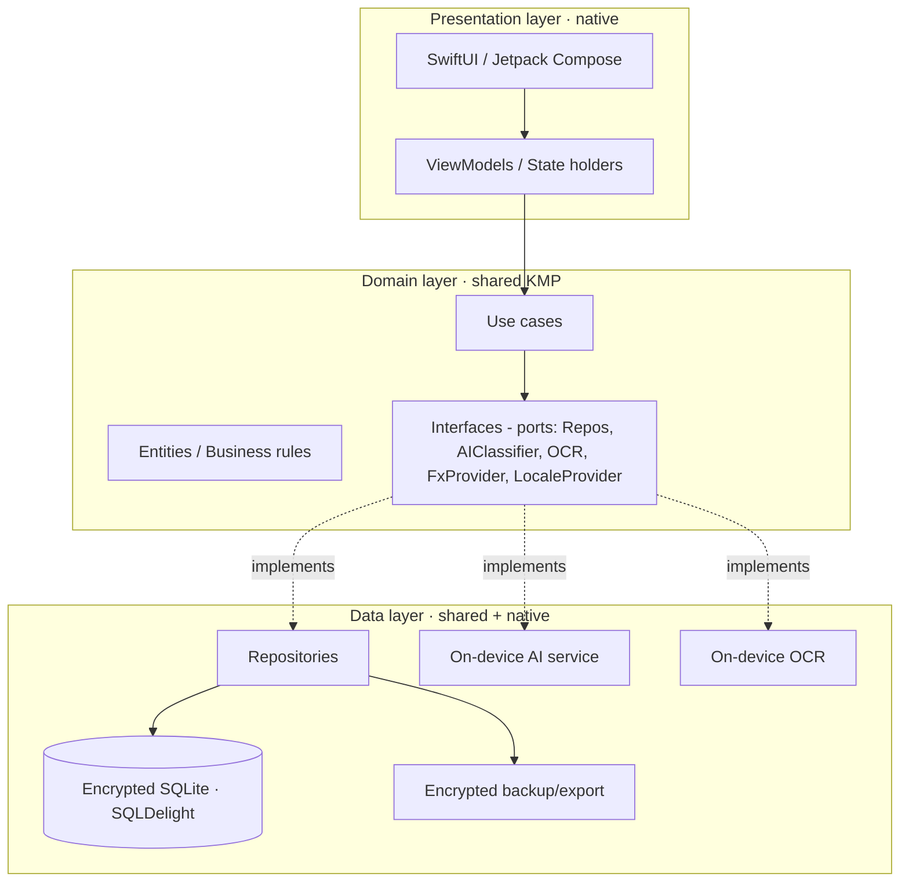

# Technical Requirements Document (TRD) — “Bolsillo”

> **Product:** Local-first personal finance app with on-device AI classification · **Platforms:** Android + iOS
> **Base document:** PRD “Bolsillo” v1.1 · **Status:** Draft v1.1 for engineering review
> **Audience:** Mobile dev team, on-device ML, QA, and DevOps.
> **v1.1 note:** adds localization (Spanish default, switchable to English) and currency requirements (USD and COP essential, base currency configurable, others addable).

---

## 1. Purpose and scope

This document translates the PRD into implementable technical requirements for the **MVP** and lays the architectural foundations for later phases. It covers stack, architecture, data model, the on-device AI engine, persistence, security, performance, robust financial handling, localization, currency handling, testing, and delivery.

**Governing constraint:** *local-first*. All core features operate without network, and no financial data leaves the device by default. Any cloud capability (backup, sync) is **optional, opt-in, and end-to-end encrypted**.

---

## 2. Architecture principles

1. **Local-first / offline-first:** the source of truth is the on-device database.
2. **Layered separation (Clean Architecture):** domain independent of framework and platform.
3. **Shared domain, native UI:** common cross-platform logic; native presentation per OS.
4. **AI is a replaceable service:** accessed behind an interface; the model can change without touching the domain.
5. **Financial integrity first:** exact arithmetic, transactional operations, no data loss.
6. **Privacy by design:** on-device inference and learning; minimal, anonymous, opt-in telemetry.
7. **Shared design system, native UI:** both apps map the same design tokens (`shared-assets/design/tokens.json`) into native theme resources and replicate the canonical design (`docs/design/`); no literal colors/sizes in UI code. Visual divergence is a shared-design-system defect, fixed there first, then in both apps.

---

## 3. Technology stack

### 3.1 Recommended decision

| Layer | Recommended technology | Alternative | Rationale |
|---|---|---|---|
| Shared logic/domain | **Kotlin Multiplatform (KMP)** | Flutter (Dart) | Clean access to native AI frameworks; performance; one domain |
| iOS UI | **SwiftUI** | — | Native, fluid, access to Core ML / Foundation Models |
| Android UI | **Jetpack Compose** | — | Native, access to LiteRT / ML Kit |
| Persistence | **SQLite** via **SQLDelight** (KMP) | Room (Android) + GRDB (iOS) | Shared typed schema, controlled migrations |
| Encryption at rest | **SQLCipher** + Keychain/Keystore | OS file encryption | Encrypted DB with a hardware-protected key |
| On-device AI (iOS) | **Core ML** (+ optional Apple Foundation Models) | — | Accelerated inference, no network or API cost |
| On-device AI (Android) | **LiteRT** (ex-TensorFlow Lite) + **ML Kit** | Gemini Nano / Gemma 3n | CPU/GPU/NPU acceleration with CPU *fallback* |
| Cross-platform model (option) | **ONNX Runtime Mobile** | Twin per-platform models | A single model artifact for both OSes |
| Receipt OCR | Apple Vision (iOS) / ML Kit Text Recognition (Android) | — | On-device OCR, no network |
| Localization | Native string catalogs (iOS) / Android resources, or shared KMP i18n | — | Spanish default, switchable to English; ready for more |

> **If development speed is prioritized over native AI access:** Flutter + LiteRT/MediaPipe plugins is viable, with more friction for Apple Foundation Models and specific accelerators.

### 3.2 Supported versions
- **iOS:** recent versions with Core ML / Vision support; *fallback* to a lightweight classifier when no acceleration is available.
- **Android:** modern API with LiteRT; **mandatory fallback to CPU** and to “rules + dictionary only” mode on low-end devices.

---

## 4. System architecture



**Layer rules:** the UI never touches the database directly; the domain knows nothing of SQLite or Core ML/LiteRT (only interfaces). The AI service is injected as an implementation of an `ExpenseClassifier` port.

---

## 5. Data model

### 5.1 Main entities

| Entity | Key fields | Notes |
|---|---|---|
| **Account** | `id`, `name`, `type`(cash/debit/credit/bank/savings/wallet/other), `currency`, `initial_balance_minor`, `icon`, `color`, `archived`, `credit_limit_minor?`, `statement_day?`, `payment_day?` | Balance computed; not stored denormalized except as cache |
| **Transaction** | `id`, `account_id`, `type`(expense/income/transfer), `amount_minor`, `currency`, `fx_rate`, `amount_base_minor`, `category_id?`, `merchant?`, `note?`, `occurred_at`, `transfer_group_id?`, `recurring_id?`, `source`(manual/nl/receipt), `ai_suggested_category_id?`, `ai_confidence?`, `created_at`, `updated_at`, `deleted_at?` | `deleted_at` = trash (soft delete) |
| **Category** | `id`, `parent_id?`, `name`, `icon`, `color`, `is_system`, `archived` | 2-level tree; system names localized via string keys |
| **Tag** + **TransactionTag** | `id`, `name` / (`transaction_id`,`tag_id`) | n:m relation |
| **Budget** | `id`, `category_id?`, `period_type`(weekly/monthly/custom), `amount_minor`, `currency`, `start_date`, `rollover`(bool), `bucket`(fixed/recurring/flexible?) | `category_id` null = global budget |
| **RecurringRule** | `id`, template (`type`,`amount_minor`,`category_id`,`account_id`,`merchant`), `frequency`, `interval`, `next_run_date`, `end_date?`, `reminder`(bool), `auto_create`(bool) | Generates transactions |
| **CategorizationRule** | `id`, `match_type`(merchant_contains/amount_eq/...), `match_value`, `category_id`, `priority`, `enabled` | User rules (AI Layer 1) |
| **MerchantDictionary** | `pattern`, `category_id`, `locale` | Bundled/updatable data (Layer 2) |
| **AiCorrection** | `id`, `features_blob`, `chosen_category_id`, `created_at` | Labels for on-device learning |
| **Currency** | `code`(ISO 4217, e.g., USD, COP), `symbol`, `decimal_digits`, `is_enabled`, `is_essential` | Catalog of available currencies; **USD and COP seeded as essential/enabled** |
| **FxRate** | `from_currency`, `to_currency`, `rate`, `as_of_date`, `source` | Rates; historical |
| **AppSetting** | `key`, `value` | Includes `base_currency`, `language`/`locale`, `ai_confidence_threshold`, lock, etc. |

### 5.2 Integrity rules
- **Transfer** = 2 transactions linked by `transfer_group_id` (one negative at the source, one positive at the destination); they do **not** count as expense or income in reports.
- Deletion = `deleted_at` (trash with configurable purge); **never** an immediate physical delete.
- `amount_base_minor` is computed on creation with the current `fx_rate` and **frozen** (not recomputed when future rates change).
- Every write goes through a DB transaction; derived balances are recomputed consistently.

### 5.3 Migrations
- **Versioned** schema; idempotent migrations tested with sample data; release blocked if a migration is irreversible or loses data.

### 5.4 Currency catalog (essential + extensible)
- The **Currency** table is **seeded with USD and COP** flagged `is_essential = true` and enabled by default.
- The user can **enable additional ISO 4217 currencies** and set any enabled currency as the **base currency** (`AppSetting.base_currency`).
- Essential currencies cannot be removed (only the non-essential ones the user adds can be disabled), to guarantee a working default.
- Amounts use each currency's `decimal_digits` for minor-unit handling.

### 5.5 Localization data
- `AppSetting.language` (`locale`) stores the selected UI language; **default `es` (Spanish)**, switchable to **`en` (English)**.
- System category names, default account names, and all UI strings are stored as **string keys**, resolved per locale — never hard-coded — so switching language is instant and complete.

---

## 6. On-device AI engine (technical specification)

### 6.1 Contract (domain port)
```
interface ExpenseClassifier {
  suspend fun suggest(input: ClassificationInput): ClassificationResult
  suspend fun learn(correction: AiCorrection)   // incremental local learning
}
ClassificationInput  = { text (merchant+note), amountMinor, currency, occurredAt, accountType }
ClassificationResult = { topCategoryId, confidence (0..1), alternatives: List<CategoryId> (top-3) }
```

### 6.2 Cascade pipeline
1. **User rules** (`CategorizationRule`) → if matched, confidence = 1.0.
2. **Merchant dictionary** (`MerchantDictionary`) → pattern match, high confidence.
3. **On-device ML classifier** → category + calibrated confidence.
4. **Threshold:** `confidence ≥ THRESHOLD` (default **0.75**, configurable) → applied automatically (with undo). Below → “to confirm” state with top-3.

### 6.3 Input features
- Normalized merchant/note text → **embeddings** (lightweight quantized text encoder, or hashed n-grams on low-end).
- Normalized / bucketed `amount_minor`.
- Time of day and day of week (one-hot).
- `account_type`, `is_recurring`.

> Note: the classifier is **language-aware** — the merchant dictionary and base corpus prioritize Spanish/LatAm; switching UI language does not retrain the model, but the corpus should cover both es and en merchant terms.

### 6.4 Model and personalization
- **Recommended architecture:** a **frozen** base text encoder (bundled in the app) + an **on-device personalizable classification head**:
  - Option A: **kNN** over embeddings (ideal for personalization without retraining; learns instantly with each correction).
  - Option B: **logistic regression / shallow MLP** re-tunable locally.
- **Cold start:** base model trained on a generic corpus (expected ~70–80% accuracy). After ~50–100 user corrections, the personalized head raises accuracy to ~95%+.
- **Learning loop:** each confirmation/correction creates an `AiCorrection`; re-tuning runs in the background (while charging/connected) and is **100% on-device**.

### 6.5 Runtime and format
- iOS: **Core ML** (`.mlmodel`/`.mlpackage`); Android: **LiteRT** (`.tflite`).
- Unified alternative: **ONNX** + ONNX Runtime Mobile.
- **Model versioning:** `model_version` in `AppSetting`; the base model ships with the app or as an optional download; the user's personalization is **not** overwritten when the base model updates (head migration strategy).

### 6.6 OCR and natural language (MVP)
- **Receipt OCR:** Vision / ML Kit on-device; extracts amount, date, and merchant; feeds the classifier.
- **Natural language (MVP):** a **rules/regex** parser for amount + currency + keywords (“coffee 8k” → 8,000 / Coffee shop). The **on-device LLM** (Apple Foundation Models / Gemini Nano / Gemma) is deferred to a later phase. The parser must handle Spanish and English number/keyword expressions.

### 6.7 Quality metrics (local)
- Correction rate, average confidence, % auto-applied. Computed on the device; shared only **in aggregate and anonymous** form if the user opts in. Expenses are never sent.

---

## 7. Persistence, backup, and portability

- **DB:** encrypted SQLite (SQLCipher). Indexes on `occurred_at`, `account_id`, `category_id`, `transfer_group_id`.
- **Encrypted backup:** proprietary encrypted format (key derived from passphrase/biometrics) to the user's storage (local file, the user's own iCloud/Drive), never to our servers by default.
- **Export/Import:** CSV (transactions, accounts, categories) and a proprietary format. Import of bank CSV statements and migration from other apps.
- **No lock-in:** the user can export everything at any time.

---

## 8. Security

- **Encryption at rest** of the full database; key protected by **Keychain (iOS) / Keystore (Android)** and hardware-backed where available.
- **App lock** via biometrics or PIN, with configurable auto-lock.
- **No mandatory account.** No PII collection.
- **Minimal, runtime-justified permissions:** camera (receipts only), location (optional, only to improve suggestions, processed on-device).
- If sync is enabled (post-MVP): **E2E**; the server only stores encrypted blobs (zero knowledge).

---

## 9. Robust financial handling (non-negotiable requirements)

1. **Money in integer minor units** (`*_minor`, e.g., cents) or a fixed-precision Decimal type. **Using `float`/`double` for money is forbidden.**
2. **Rounding** defined and consistent (banker's half-up) and tested.
3. **Transfers** as a linked double entry; balances always reconcile.
4. **Transactional and idempotent operations**; no write leaves a half state.
5. **Multi-currency:** `fx_rate` and `amount_base_minor` **frozen** per transaction; faithful historical conversion; unified view that **preserves the original amount**.
6. **Crash recovery:** the DB never gets corrupted; WAL journaling.
7. **Audit / trash:** nothing is lost accidentally.

---

## 10. Currency and localization handling (detailed requirements)

### 10.1 Currencies
- The currency catalog **must ship with USD and COP enabled and flagged essential**; both are always available.
- The user can **add other ISO 4217 currencies** and **set any enabled currency as the base currency**.
- Each transaction stores its own currency + frozen FX rate; totals roll up to the base currency while each item retains its original amount.
- Number/symbol formatting respects each currency's `decimal_digits` and the active locale.

### 10.2 Language
- **Default UI language: Spanish (`es`).** A settings toggle **switches to English (`en`)** and applies app-wide immediately, without restart where possible.
- All user-facing strings come from localized resources (string keys); no hard-coded text.
- Architecture must allow **adding more languages later** by dropping in new resource sets, with no code changes.
- Date, number, and currency formats follow the selected locale.

---

## 11. Performance (measurable targets)

| Operation | Target |
|---|---|
| Cold start | ≤ 1.5 s |
| Save a transaction | ≤ 100 ms |
| Categorization inference | ≤ 200 ms |
| Receipt OCR | ≤ 2 s |
| App + base model size | ≤ ~150 MB (downloadable model if it grows) |
| Background consumption (retraining) | Only while charging / under optimal conditions |
| Language switch | Applies app-wide ≤ 1 s |

---

## 12. Non-functional requirements

- **Offline:** 100% of core features without network.
- **Compatibility:** *fallback* to CPU and to “rules + dictionary” mode on devices without acceleration.
- **Accessibility:** screen reader, font scaling, AA contrast, keyboard navigation.
- **i18n/l10n:** Spanish default, switchable to English; ready for more languages; regional number/currency/date formats.
- **Theme:** light/dark.

---

## 13. Observability and analytics (privacy-first)

- **Anonymous, opt-in** product events (timings, taps, feature usage); **never** financial content.
- Crash reporting without PII.
- Local model metrics (§6.7).

---

## 14. Testing strategy

| Type | Focus |
|---|---|
| **Unit** | Business rules, use cases, **money arithmetic and rounding**, FX conversion |
| **Integration** | Repos ↔ SQLite, migrations, backup/restore, import/export |
| **Model/AI** | Base-model accuracy, confidence calibration, learning loop, *fallbacks* |
| **UI** | Critical flows: 3-tap recording, budgets, recurring, **language switch es↔en** |
| **Localization** | All screens render correctly in es and en; no truncation/hard-coded strings; currency formatting (USD, COP, +others) |
| **Performance** | Cold start, save and inference latency (low-end included) |
| **Data regression** | Guarantee **no data loss** across updates/migrations |

**Release criterion:** no migration with data loss; balances always reconcile in test suites; performance targets met on a reference low-end device; full UI coverage in both es and en.

---

## 15. CI/CD and delivery

- Reproducible build per platform; PR pipelines with lint + tests + static analysis.
- **Model packaging and versioning** as an independent artifact with its `model_version`.
- Release channels (internal/beta/production); *feature flags* to enable advanced AI gradually.
- Signing and distribution via App Store / Google Play.

---

## 16. Proposed dependencies (indicative)

- SQLDelight / SQLCipher, Core ML + Vision, LiteRT + ML Kit (or ONNX Runtime Mobile), a per-platform Decimal/money library, biometrics, CSV parser, localization/resource tooling.
- Avoid dependencies that require network for core features.

---

## 17. Constraints and assumptions

- The MVP does **not** include automatic bank sync or cross-device sync (designed not to block it later).
- The base category model and the merchant dictionary must be prepared before the MVP (initial corpus, LatAm/ES focus, with English merchant coverage).
- Initial AI quality depends on the corpus and the dictionary; the rules/dictionary *fallback* guarantees usefulness from day 1.
- Shipped UI languages for the MVP are **Spanish (default) and English**; currencies seeded are **USD and COP** (others addable).

---

## 18. Traceability PRD → TRD (summary)

| PRD requirement | Technical section |
|---|---|
| Fast recording ≤ 5 s / ≤ 3 taps | §4, §11, Stories E2 |
| Local AI categorization | §6 |
| Local-first / offline | §2, §7, §12 |
| Financial robustness | §5.2, §9 |
| Multi-currency with original amount | §5, §9, §10.1 |
| USD & COP essential, base configurable | §5.4, §10.1 |
| Spanish default, switchable to English | §5.5, §10.2 |
| Privacy by default | §8, §13 |
| Budgets / recurring / reports | §5, Stories E5–E7 |
| Backup/Export without lock-in | §7 |

---

> **Note:** decisions marked “recommended” remain open for validation via a technical *spike* (especially KMP vs Flutter and kNN vs a re-tunable head for AI personalization).
